# Разработка пользовательского интерфейса (GUI) для языкового процессора

## Цель работы
Создание кроссплатформенного графического интерфейса (GUI) для языкового процессора в виде специализированного текстового редактора.


## Автор
**ФИО:** Гусейнов Рза Анар оглы  
**Группа:** АВТ-314  
**Учебное заведение:** НГТУ

---

## Описание проекта
Программа представляет собой компилятор с графическим интерфейсом, реализованный на Java с использованием JavaFX.  

Основные возможности приложения:
- Создание, открытие, сохранение и сохранение как файлов.
- Редактирование текста (копировать, вставить, вырезать, удалить, выделить всё, отменить/повторить).
- Изменение размера шрифта текста.
- Нижняя область для вывода сообщений программы (например, информация о сохранении или открытии файла).
- Быстрый доступ к функциям через меню, панель инструментов и горячие клавиши.
- Всплывающая справка по функционалу.
- Автоматическое предложение сохранить изменения при выходе из программы или открытии нового файла.

Дополнительные задания частично реализованы:
- Изменение размера текста в окне редактирования и области вывода результатов.
- Горячие клавиши для основных команд.
- Панель инструментов с кнопками для быстрого доступа к функциям.

---

## Используемые технологии

- **Язык программирования:** Java 23
- **GUI фреймворк:** JavaFX 17
- **Среда разработки:** IntelliJ IDEA / Apache Maven

---

## Инструкция по сборке и запуску

### Установка зависимостей
1. Установить [JDK 23](https://jdk.java.net/23/).
2. Установить [Apache Maven](https://maven.apache.org/).
3. Клонировать проект из репозитория или распаковать архив проекта.

### Сборка проекта
В терминале, находясь в корне проекта, выполнить:

```bash
mvn clean package jpackage:jpackage
```
## Основные элементы

Рис. 1 - Интерфейс приложения

### Меню

**Файл:**

- Создать (Ctrl+N) – создать новый документ.
- Открыть (Ctrl+O) – открыть существующий файл.
- Сохранить (Ctrl+S) – сохранить текущий файл.
- Сохранить как – сохранить файл под новым именем.
- Выход – закрыть программу с предложением сохранить изменения.

**Правка:**

- Отменить (Ctrl+Z), Повторить (Ctrl+Y)
- Вырезать (Ctrl+X), Копировать (Ctrl+C), Вставить (Ctrl+V)
- Удалить, Выделить всё (Ctrl+A)
- Увеличить/Уменьшить шрифт

**Текст:**

- Постановка задачи, Грамматика, Классификация грамматики, Метод анализа
- Тестовый пример, Список литературы, Исходный код программы

**Пуск:**

- Запуск анализатора

**Справка:**

- Вызов справки (открывает окно с описанием функций)
- О программе

---

### Панель инструментов

- Кнопки: Создать, Открыть, Сохранить, Undo, Redo, Копировать, Вырезать, Вставить
- Иконки для быстрого доступа, соответствуют функциям меню

---

### Область редактирования

- Основная TextArea для ввода текста.
- Поддерживает перенос текста и изменение размера шрифта.
- Выводит изменения в нижнюю область при создании/сохранении/открытии файла.

---

### Область вывода результатов

- TextArea, не редактируемая пользователем.
- Отображает информацию о действиях пользователя (например, “Файл сохранён: test.txt”).

---

### Горячие клавиши

- Ctrl+N – Новый файл
- Ctrl+O – Открыть файл
- Ctrl+S – Сохранить файл

---

### Ограничения

- Многовкладочный редактор пока не реализован (только один текстовый документ за раз).
- Интернационализация не реализована, интерфейс только на русском языке.
- Нумерация строк и подсветка синтаксиса не реализованы полностью.
- Drag & Drop открытия файлов не реализован.
- Отображение ошибок в виде таблицы пока отсутствует.  

---

# Лабораторная работа №2: Разработка лексического анализатора (сканера)

## Постановка задачи
Изучить назначение и принципы работы лексического анализатора в структуре компилятора. Спроектировать алгоритм (диаграмму состояний) и выполнить программную реализацию сканера для выделения лексем из входного текста. Интегрировать разработанный модуль в ранее созданный графический интерфейс языкового процессора.

## Вариант задания: 83
**Лямбда-выражения языка Java**

Примеры корректных входных строк:
1) `operation = (x, y, z) -> x + (y * z);`
2) `(int x, int y) -> { return x + y; }`
3) `var foo = (String s) -> s.length();`
4) `() -> System.out.println("Hello");`

Перечень допустимых лексем:
- Ключевые слова (`int`, `double`, `boolean`, `return`, `var`, `void`, `String` и др.)
- Идентификаторы
- Целые числа
- Лямбда-оператор (`->`)
- Разделители (`(`, `)`, `{`, `}`, `,`, `;`, `.`)
- Операторы (`=`, `+`, `-`, `>`, `<`, `==` и др.)
- Строковые литералы (в двойных и одинарных кавычках)

## Диаграмма состояний конечного автомата

```mermaid
stateDiagram-v2
    [*] --> START
    
    START --> WHITESPACE : ' ' или \\n или \\t
    START --> ID_OR_KEYWORD : Буква, '_', '$'
    START --> NUMBER : Цифра
    START --> STRING : " или '
    START --> OPERATOR : +, -, *, /, =, <, >, !, &, |
    START --> SEPARATION : (, ), {, }, ,, ;, .
    START --> ERROR : Любой другой недопустимый символ
    
    WHITESPACE --> WHITESPACE : ' ' или \\n или \\t
    WHITESPACE --> [*] : Иной символ (сборка пробелов)
    
    ID_OR_KEYWORD --> ID_OR_KEYWORD : Буква, Цифра, '_', '$'
    ID_OR_KEYWORD --> [*] : Проверка по словарю ключевых слов
    
    NUMBER --> NUMBER : Цифра
    NUMBER --> [*] : Остановка чтения числа
    
    OPERATOR --> OPERATOR2 : Смотрим следующий символ (напр. '-' -> '>', '=' -> '=')
    OPERATOR --> [*]
    OPERATOR2 --> [*]
    
    STRING --> STRING : Любые символы (кроме кавычки)
    STRING --> STR_CLOSED : Закрывающая кавычка
    STRING --> STR_ERROR : Конец файла (ошибка)
    STR_CLOSED --> [*]
    STR_ERROR --> [*]
    
    SEPARATION --> [*]
    ERROR --> [*]
```

**Краткое описание:** Из начального состояния сканер считывает символ и переходит в соответствующее состояние обработки типа лексемы. Чтение продолжается до тех пор, пока символ принадлежит сканируемой лексеме. По завершении формируется токен, и автомат возвращается в начальное состояние для чтения следующей лексемы.

## Тестовые примеры

**Корректная многострочная строка:**
```java
(int x, int y) -> {
    return x + y;
}
```

**Ожидаемые токены:**
| Условный код | Тип лексемы | Лексема | Местоположение |
| --- | --- | --- | --- |
| 4 | разделитель | ( | строка 1, 1-1 |
| 14 | ключевое слово | int | строка 1, 2-4 |
| 11 | разделитель (проб/пер) | (пробел) | строка 1, 5-5 |
| 2 | идентификатор | x | строка 1, 6-6 |
| 4 | разделитель | , | строка 1, 7-7 |
| 11 | разделитель (проб/пер) | (пробел) | строка 1, 8-8 |
| 14 | ключевое слово | int | строка 1, 9-11 |
| 11 | разделитель (проб/пер) | (пробел) | строка 1, 12-12 |
| 2 | идентификатор | y | строка 1, 13-13 |
| 4 | разделитель | ) | строка 1, 14-14 |
| 11 | разделитель (проб/пер) | (пробел) | строка 1, 15-15 |
| 3 | лямбда оператор | -> | строка 1, 16-17 |
| 11 | разделитель (проб/пер) | (пробел) | строка 1, 18-18 |
| 4 | разделитель | { | строка 1, 19-19 |
| 11 | разделитель (проб/пер) | (перенос+проб) | строка 1, 20 к строке 2, 4 |
| 14 | ключевое слово | return | строка 2, 5-10 |
| 11 | разделитель (проб/пер) | (пробел) | строка 2, 11-11 |
| 2 | идентификатор | x | строка 2, 12-12 |
| 11 | разделитель (проб/пер) | (пробел) | строка 2, 13-13 |
| 10 | оператор | + | строка 2, 14-14 |
| 11 | разделитель (проб/пер) | (пробел) | строка 2, 15-15 |
| 2 | идентификатор | y | строка 2, 16-16 |
| 16 | конец оператора | ; | строка 2, 17-17 |
| 11 | разделитель (проб/пер) | (перенос) | строка 2, 18 к строке 3, 0 |
| 4 | разделитель | } | строка 3, 1-1 |

**Некорректная строка (символ #):**
`() -> # {}`

| Условный код | Тип лексемы | Лексема | Местоположение |
| --- | --- | --- | --- |
| 4 | разделитель | ( | строка 1, 1-1 |
| 4 | разделитель | ) | строка 1, 2-2 |
| 11 | разделитель (проб/пер) | (пробел) | строка 1, 3-3 |
| 3 | лямбда оператор | -> | строка 1, 4-5 |
| 11 | разделитель (проб/пер) | (пробел) | строка 1, 6-6 |
| 17 | ошибка (недоп. символ) | # | строка 1, 7-7 |
| ... | ... | ... | ... |

*При щелчке по строке с ошибкой (код 17) в приложении, курсор в редакторе перейдет к позиции знака `#`.*