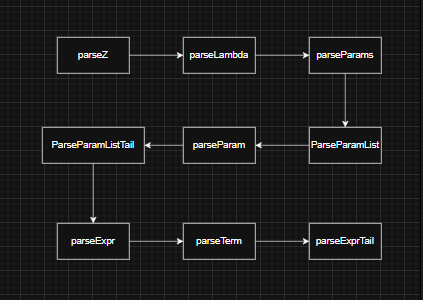
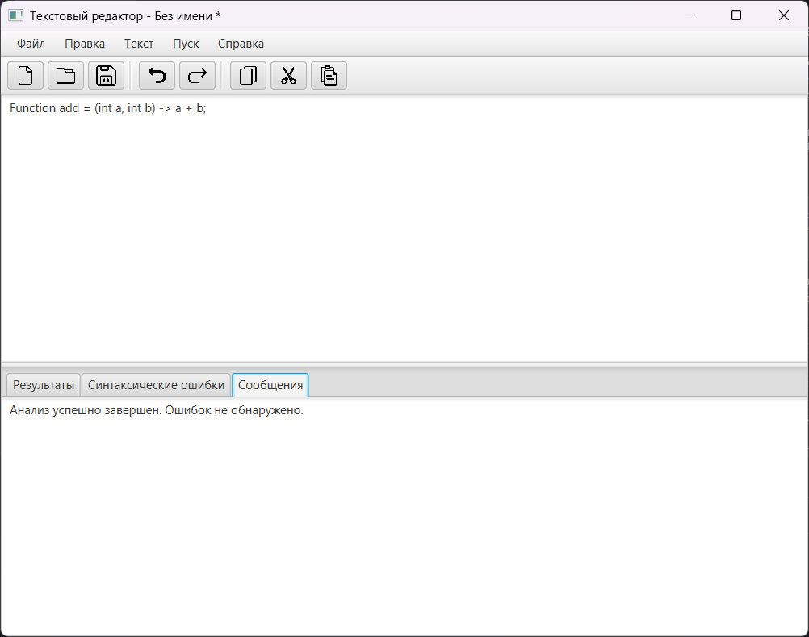
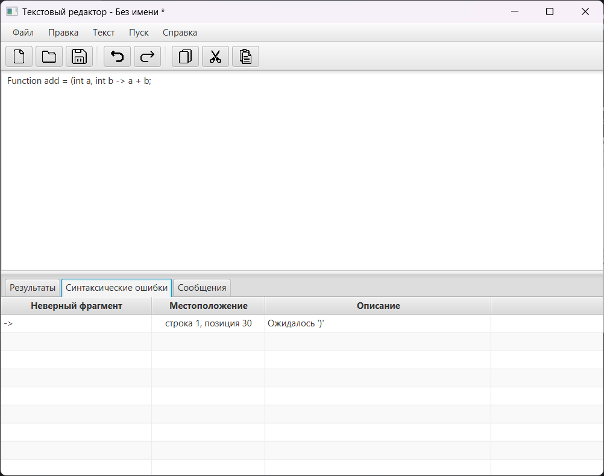
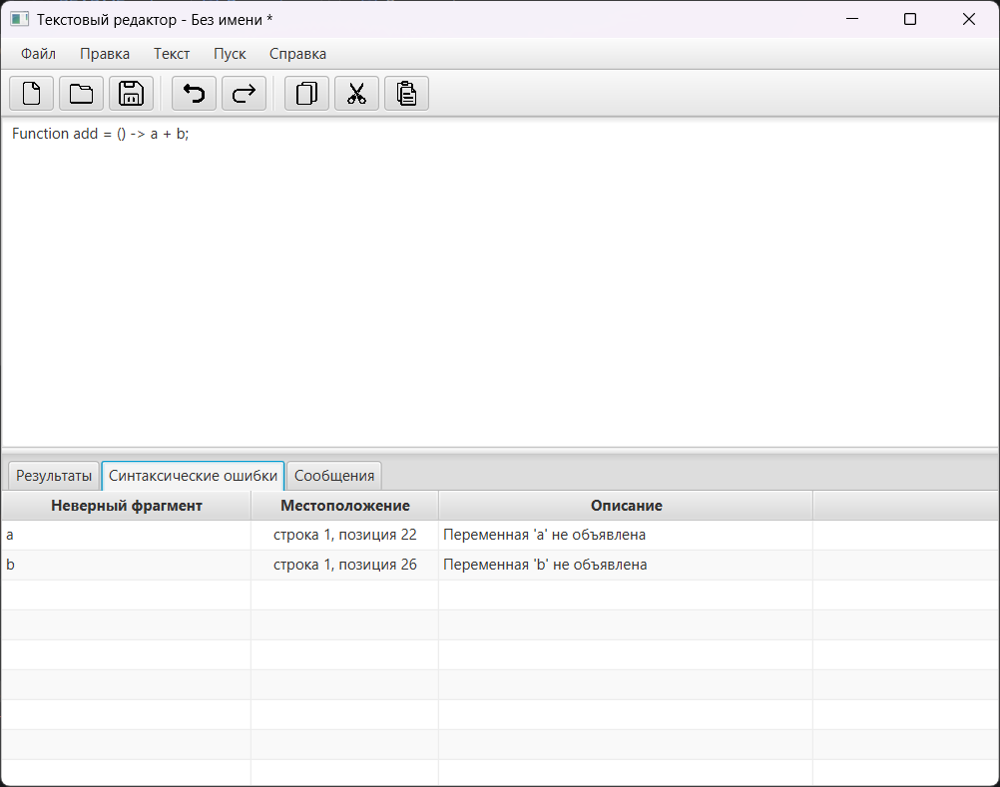
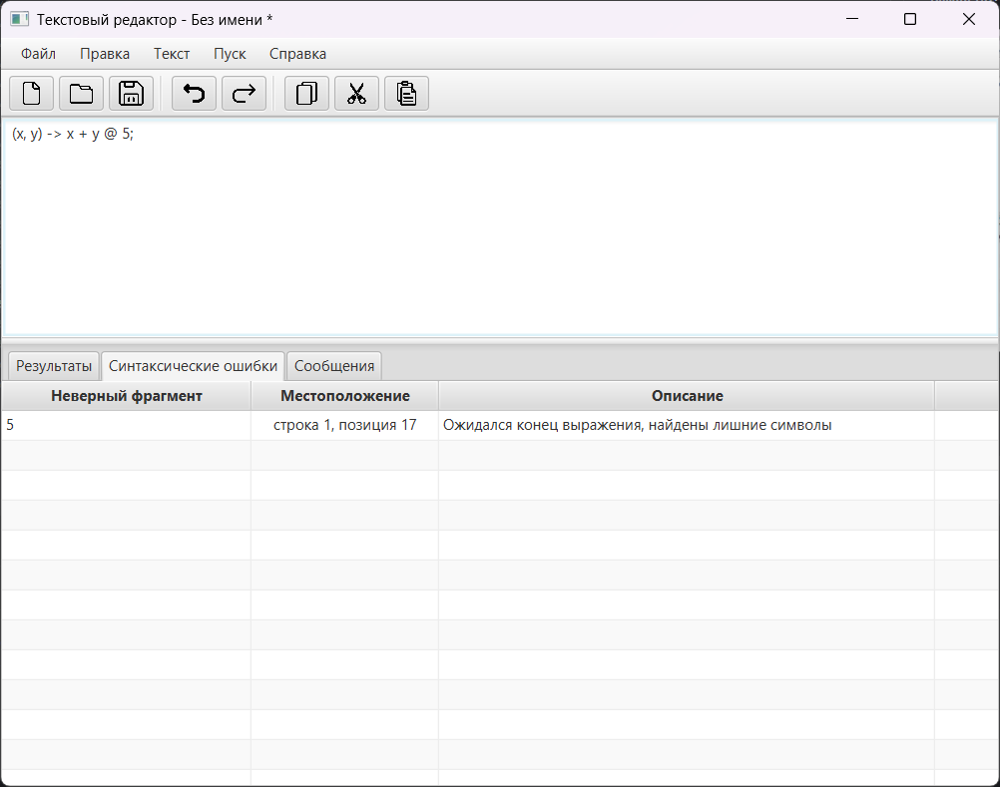

# Лабораторная работа: Разработка лексического и синтаксического анализатора

## 1. Название и цель лабораторной работы
**Название:** Разработка синтаксического анализатора (парсера)

**Цель работы:** 
Изучить назначение и принципы работы синтаксического анализатора 
в структуре компилятора. Спроектировать грамматику, построить 
соответствующую схему метода анализа грамматики и выполнить 
программную реализацию парсера с нейтрализацией синтаксических 
ошибок методом Айронса. Интегрировать разработанный модуль 
в ранее созданный графический интерфейс языкового процессора.
---

## 2. Сведения об авторе
* **ФИО:** Гусейнов Р.А.
* **Группа:** АВТ-314

---

## 3. Постановка задачи

Разработать синтаксический анализатор (парсер) в соответствии
с индивидуальным вариантом курсовой (расчетно-графической) 
работы, интегрировать его в приложение из лабораторной работы №1
и обеспечить наглядный вывод результатов анализа.

---

## 4. Вариант задания
**Тема:** Лямбда-выражения языка Java.

**Примеры корректных входных строк:**
1. `Function op = (int x, int y) ->  x + y;` (Присваивание, полное определение параметров, арифметическое выражение)
2. `mult = x -> x * 2;` (Присваивание в существующую переменную, один параметр без скобок)
3. `() -> (10 + 5) / 2;` (Без параметров, арифметическое выражение со скобками)

**Перечень допустимых лексем:**
* **Ключевые слова:** `int`, `double`, `float`, `boolean`, `char`, `byte`, `short`, `long`, `var`, `void`, `return`, `String`, `new`, `const`
* **Идентификаторы:** Последовательности из букв, цифр, `_` и `$`, начинающиеся не с цифры.
* **Числа:** Целые (`123`) и вещественные (`45.67`)
* **Строковые литералы:** Ограничены двойными или одинарными кавычками (`"text"`, `'text'`)
* **Лямбда-оператор:** `->`
* **Операторы:** `+`, `-`, `*`, `/`, `=`, `++`, `--`
* **Разделители:** `(`, `)`, `,`, `.`, `;`

---

## 5. Разработка грамматики
Грамматика спроектирована для разбора лямбда-выражений и адаптирована под LL(1) парсинг (без левой рекурсии).

**Полное определение грамматики:**
```text
1. <Z> -> <LVal> '=' <Lambda> ';' | <Lambda> ';'
2. <LVal> -> <Type> <Identifier> | <Identifier> <Identifier> | <Identifier>
3. <Lambda> -> <Params> '->' <Expr>
4. <Params> -> '(' <ParamList> ')' | '(' ')' | <Identifier>
5. <ParamList> -> <Param> <ParamListTail>
6. <ParamListTail> -> ',' <Param> <ParamListTail> | ε
7. <Param> -> <Type> <Identifier> | <Identifier>
8. <Expr> -> <Term> <ExprTail>
9. <ExprTail> -> <Op> <Term> <ExprTail> | ε
10. <Op> -> '+' | '-' | '*' | '/'
11. <Term> -> <Identifier> | <Number> | '(' <Expr> ')'
12. <Type> -> 'int' | 'double' | 'float' | 'boolean' | 'char' | 'byte' | 'short' | 'long' | 'var' | 'void' | 'String' | 'const'
13. <Identifier> -> letter <IdentifierRem> | '_' <IdentifierRem> | '$' <IdentifierRem>
14. <IdentifierRem> -> letter <IdentifierRem> | digit <IdentifierRem> | '_' <IdentifierRem> | '$' <IdentifierRem> | ε
15. <Number> -> <Integer> <Fraction>
16. <Integer> -> digit <IntegerTail>
17. <IntegerTail> -> digit <IntegerTail> | ε
18. <Fraction> -> '.' <Integer> | ε
19. digit -> '0' | ... | '9'
20. letter -> 'a' | ... |'z' | 'A' | ... | 'Z'
```
*(где ε — пустая цепочка / эпсилон)*

### Словари грамматики  $G[\langle Z \rangle]$: ###

**Аксиома:** $\langle Z \rangle$

**Множество нетерминалов ($V_N$):** { $\langle Z \rangle$, $\langle LVal \rangle$, 
$\langle Lambda \rangle$, $\langle Params \rangle$, $\langle ParamList \rangle$, 
$\langle ParamListTail \rangle$, $\langle Param \rangle$, $\langle Expr \rangle$, 
$\langle ExprTail \rangle$, $\langle Op \rangle$, $\langle Term \rangle$, 
$\langle Type \rangle$, $\langle Identifier \rangle$, $\langle IdentifierRem \rangle$, 
$\langle Number \rangle$, $\langle Integer \rangle$, $\langle IntegerTail \rangle$, 
$\langle Fraction \rangle$ }

**Множество терминалов ($V_T$):** { =, ;, ->, (, ), ,, +, -, *, /, ., _, $, 0, ..., 9, a, ..., z, A, ..., Z }

---

## 6. Классификация грамматики (по Хомскому)
Согласно классификации Хомского, полученная порождающая грамматика G[<Z>] 
соответствует типу контекстно-свободных, так как правая часть каждой редукции 
начинается либо с терминального символа, либо с нетерминального, принадлежащего объединённому словарю. 
$A \rightarrow \alpha, A \in V_N, \alpha \in V^*$.
Грамматика G[Z] не является автоматной, так как не все её редукции начинаются с терминального символа. 
По этой же причине данная грамматика не является S-грамматикой.

---

## 7. Метод анализа
Алгоритм синтаксического анализа реализован **методом рекурсивного спуска** (нисходящий синтаксический анализ). 
Для каждого нетерминального символа грамматики (например, `parseLambda`, `parseExpr`, `parseBody`) 
написана отдельная программная функция. Эти функции рекурсивно вызывают друг друга в процессе разбора 
токенов по правилам грамматики.


---

## 8. Диагностика и нейтрализация синтаксических ошибок
Для нейтрализации ошибок реализован **метод Айронса (Panic mode / метод синхронизирующих токенов)**.
Если парсер ожидает определенный токен или структуру, но получает неверный токен, он фиксирует синтаксическую 
ошибку ("Ожидался идентификатор", "Ожидалось ')'") и переходит в режим восстановления: 
Программный парсер пропускает (игнорирует) токены входного потока до тех пор, пока не встретит один 
из **синхронизирующих токенов** из множества `Follow` для текущего контекста 
(например, `;`, `}`, `)` или `->`). После этого анализ возобновляется с известной безопасной позиции, 
что позволяет обнаруживать несколько ошибок в одном выражении без преждевременного падения программы.

---

## 9. Тестовые примеры

В данном разделе представлены примеры анализа корректных строк и строк с намеренными синтаксическими 
ошибками для проверки модуля нейтрализации (Panic Mode).

### Пример 1: Корректное выражение (присваивание лямбды)
**Код:**
```java
Function add = (int a, int b) -> a + b;
```
**Результат:** Лексический и синтаксический анализ прошли успешно. Ошибок нет.



### Пример 2: Синтаксическая ошибка (пропущена закрывающая скобка)
**Код:**
```java
Function add = (int a, int b -> a + b;
```
**Результат:** Парсер должен найти ошибку "Ожидалось ')'".



### Пример 3: Отсутствие параметров у лямбды
**Код:**
```java
Function add = () -> a + b;
```
**Результат:** Будет сообщено, что "Переменная 'a' не объявлена" и "Переменная 'b' не объявлена". 



### Пример 4: Использование лексически неверного символа
**Код:**
```java
(x, y) -> x + y @ 5;
```
**Результат:** Сканер зафиксирует лексическую ошибку "Недопустимый символ" на символе `@`. Синтаксический анализатор, поскольку он игнорирует токены с лексическими ошибками, корректно разберет часть `(x, y) -> x + y` как завершенное выражение. Встретив затем оставшийся токен `5`, парсер зафиксирует синтаксическую ошибку: *"Ожидался конец выражения, найдены лишние символы"*.

